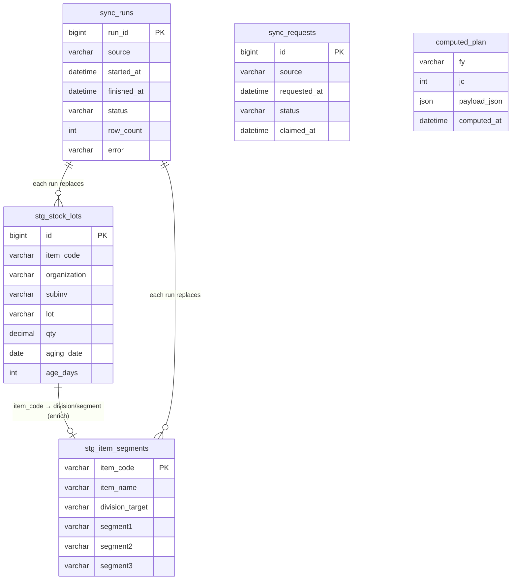
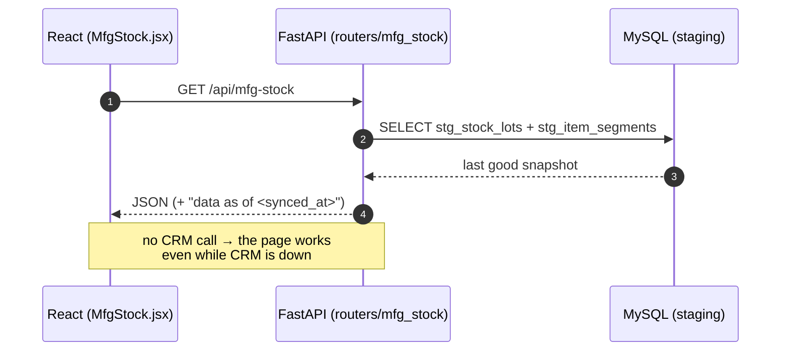
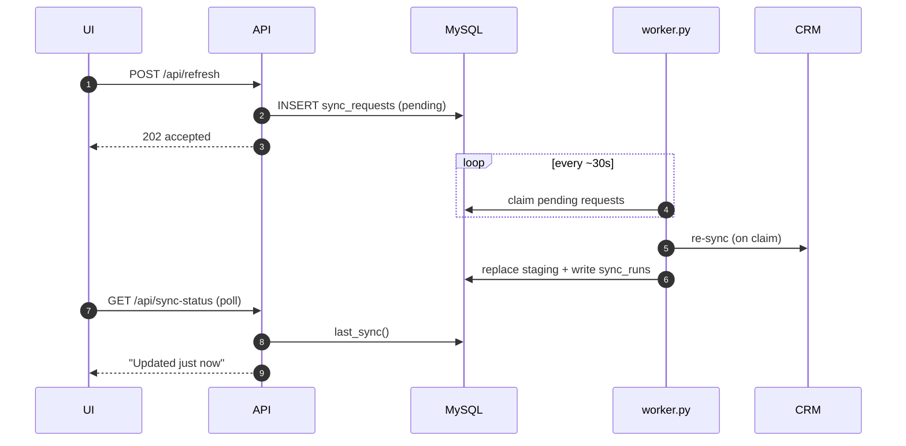

# S&OP Planning Tool — Target Architecture (Design Doc)

**Status:** proposal for review · **Scope:** single on-prem server · **Freshness target:** CRM data a few minutes old is acceptable (scheduled sync + "Refresh now").

This document describes where the backend is today, what's wrong with it for production,
and the target "sync-to-DB, serve-from-DB" architecture — plus a concrete, incremental
migration plan that keeps the app working at every step.

## Implementation status (updated as phases land)

**Done — 13 CRM sources now served from MySQL (worker syncs; API reads staging):**

| Source | Staging table | Pages made CRM-outage-proof |
|---|---|---|
| item_segments, stock_lots | stg_item_segments, stg_stock_lots | MFG-Stock |
| stock_details, item_business, pto_pts | stg_stock_details, stg_item_business, stg_pto_pts | orgs, item master |
| stock_aged, vooki_items, soc_schedule | stg_stock_aged, stg_vooki_items, stg_soc_schedule | Aged-RM |
| projection, soc_pending, soc_detail, intransit | stg_projection, stg_soc_pending, stg_soc_detail, stg_intransit (+ sync_context) | **RM-Plan, Adhoc** |
| dispatch (jc3 + jc13) | stg_dispatch (long↔wide pivot) | **MSL, RM-Plan (MSL top-ups)** |
| user_scope (6 CRM mapping tables → 8 personas) | stg_user_scope (one row per user × atomic grant; CSV collector lists exploded) | **My Dashboard** (see `db/migrate_user_scope.sql`) |
| dispatch_scope (FnDespatchDetails, 13-JC window) | stg_dispatch_scope (JC × item × customer × collector × mc_code, qty + value) | **My Dashboard** charts (see `db/migrate_dashboard.sql`; item_segments also gained segment4) |
| projection_rows (now JC1..current, not just the planning JC) | stg_projection_rows | **My Dashboard** projection-accuracy trend for collector-scoped personas |
| order_commit (**dbo.SocPendingDetails**, CRM's daily pending-SOC snapshot) | stg_order_commit (whole pending book: committed + rescheduled + customer-requested dates, reasons, warehouse note, executive, segments) | **Commitment Risk** page (see `db/migrate_commit.sql`) |
| projection_customer (SCBusinessMonthlyPlanDtls, JC1..planning JC) | stg_projection_customer (customer × item × collector × JC, week1/week2 split, mc_code from the customer's primary site, item_code from itemmasters) | **Demand Protection** page (see `db/migrate_demand_ledger.sql`) |
| rm_price_moves (**PurchaseRequisitionDtls**: lastpoprice vs unit_price, 90-day window) | stg_rm_price_move (one row per RM, signed % computed here, placeholder/implausible rows flagged) | **RM Price Impact** card on My Dashboard (see `db/migrate_rm_price.sql`) |

**Promise Dates — the supply timeline.** Per item, every dated supply event goes on
one ladder and the company's dated firm orders burn it down: stock on hand today,
production (saved-plan job end + `receipt_std_lead_days`), and open POs. From the walk:
`ctp` (first date the running balance covers what is needed), `risk_date` (first date it
goes negative), `days_to_risk`, and `slip_days = ctp - required`.

Four rules that are easy to get wrong:

* **A node is always evaluated at TODAY.** Seeding the promise from the opening balance
  ignored orders already past due — they are applied today and must consume stock before
  anything can be promised out of it. Getting this wrong wrongly promised 16 items
  "available now".
* **Inbound PO arrival is MODELLED, never promised.** `BiPoDetails` has no
  expected-arrival column, so arrival = po_date + the item's average lead time from our
  own receipt history (median 14 days). Every such event carries `estimate=True` and the
  UI marks the date `~`.
* **MSL is a warning here, not a wall.** Phase 2's ATP subtracts it ("how much is safe to
  plan against"); a promise date answers "when can we physically deliver", and 45% of
  exposed items already sit below their safety level. The promise is made and
  `breaches_msl` is flagged.
* **The requirement is dated to a half-cycle.** A projection carries no day-level date —
  only which half of the JC the planner used. Day-level slippage exists only where a
  CUSTOMER requested date does, and that lives on order lines.

Coverage ceiling: only 83 of 347 exposed items carry any forward supply (34 production,
49 inbound). The rest are reported as "no dated supply" rather than given an invented
date — nothing planned is visible to us, which is not the same as cannot be supplied.

**The projection card states five plain figures, not a score.** Upcoming Projection,
3-cycle Avg Dispatch, Projection vs Avg (%), Projection Uplift (%) and Projection Gap (KG),
with the arithmetic printed beside each value so nothing is taken on trust. It replaced a
100 - WMAPE gauge that read as confusing: one clamped percentage could not say whether a
plan was too big or too small, and it floored at 0% for every error past 100%. The
comparison is TOTAL to TOTAL - all upcoming projection against all recent dispatch;
restricting the dispatch side to items that happen to carry a projection would flatter the
ratio by hiding everything selling with no plan behind it. The colour band follows the
plan's own +/-20% tolerance (`planning_filter._proj_flag`), so "in line" means the same
thing here as everywhere else. The per-cycle WMAPE history stays underneath in table view,
labelled as hindsight.
Which plan is scored depends on where we sit in the cycle - inside the final 7 days the
current cycle is nearly spent, so the NEXT cycle's projection is scored instead. Note that
`jc_window()` ends at the cycle we are INSIDE, so that last entry is partly dispatched and
the completed cycles are the ones before it: today (JC6, 4 days left) the card scores the
JC7 plan against JC3/JC4/JC5. The per-JC table below it keeps the hindsight metric and is
labelled as such, so the two numbers cannot be confused.

**Projection accuracy scores the last 3 completed cycles.** `overall_accuracy_proj` is
100 - WMAPE per item, volume-weighted across cycles (`_weighted_mean`, not pooled - see
its docstring), over the three most recent completed JCs rather than the whole accounting
year (`_ACC_JCS`). A JC1 miss six cycles ago says nothing about how the team projects now,
and averaging it in flattens the movement the card exists to show; the per-JC trend beside
it still runs the full year. `accuracy_jcs` names the cycles so the card can say which.
Both sides of the comparison carry the item filter above - without it the trend scored
projections for made goods against dispatch that included the traded book.

**The annual plan and the cycle projection are joined.** They are two fields of the SAME
CRM plan row - `SCBusinessMonthlyPlanHdrs.annual_budget_qty` is the yearly commitment and
the `jc{n}_week1/week2_user_dfn_qty` columns on the matching detail are that rep's phasing
of it - so they join exactly on customer x item. The commercial table therefore carries
`budget_cycle` (annual budget / 13, `_JC_PER_YEAR`), the projection for the cycle the
projection card scores, and the variance between them. A line budgeted with no projection
renders as "none" rather than a dash, and the card header counts them.

Two things to keep straight:

* The pro-rata is FLAT. Real demand is seasonal, so a single cycle can legitimately sit
  either side of budget/13; the figure is reliable for "nothing at all versus something",
  which is where the gap actually lives, and weak for judging one cycle in isolation.
* `budget_cycle` is rounded PER ROW so the footer equals the column above it. Summing N
  rounded values drifts up to 0.05 x N from the exact total / 13 - 24.7 KG over Admin's
  22,744 rows. The suite's tolerance scales with the row count for that reason.

**The Projection-by-JC download carries extra detail for a Division Head**
(`dashboard_export.JC_DETAIL_PERSONAS`, Admin included because it backs the View-as
switcher). Two further sheets behind the cycle totals. "By item and activity" is a
per-item x per-cycle grid: item code, name, ACTIVITY (Manufacturing / Repack-Relabel,
from `item_activity.activity_map`) and segment, then projected / actual / accuracy for
each of the last `JC_DETAIL_CYCLES` (4) COMPLETED cycles of the accounting year - JC2..JC5
today - and the four-cycle totals with an overall accuracy. "By segment 3" rolls the
current cycle's projection against actual up to Segment 3. The gate reads the PAYLOAD's
own persona, which is the already-resolved one, so no other role reaches it by editing
the URL and View-as shows exactly what that person would get.

The per-cycle grid is NOT in the payload. `dashboard.jc_item_detail` builds it on demand
for this one download, because the page payload carries only per-cycle TOTALS plus a
per-item 3-cycle average, and shipping the grid to every load would cost every persona
for something one of them opens. It slices history through `_proj_history` with the SAME
basis `_proj_map` used for the headline, so the sheet and the card are measured over one
book, and caps at `_JC_DETAIL_ITEM_CAP` (2000) - complete for a Division Head (520 items)
and for Admin (730). Rows with neither projection nor dispatch across all four cycles are
dropped, and so is all dispatch to `JC_DETAIL_EXCLUDE_COLLECTORS` (GROUP COMPANY)
- an inter-group transfer rather than a sale, the biggest collector in
stg_dispatch at 10,296 rows and 40.7% of Admin's actual volume over JC2-JC5, and
present in NO projection table, so it can only ever widen the gap it is measured
against. It is passed as `dashboard_datasets(exclude_collectors=...)`, which
filters the DISPATCH side only: projected columns are untouched, actual columns
drop, accuracy is recomputed from the pair that is left, and an item whose only
movement was a transfer leaves the sheet (Admin 730 -> 643 items). This applies to
THIS sheet alone, so it deliberately does NOT tie to the "Projection by JC" and
"By segment 3" sheets beside it, which still count the whole book. Two keys are in play and they are not interchangeable: quantities aggregate on
`_norm(name)`, but `activity_map` is keyed by `_pf._squash(name)`, so the activity lookup
squashes the row's stored name - using `_norm` there silently blanked every activity.

**The projection gap is decomposed into four parts that SUM to it** (`forward.parts`), so
the split can be checked rather than believed. The buckets are assigned at the SAME grain as
the lines they hold - customer x item - because deciding them on each item's totals let a
line contradict its own label: 184 of Admin's 500 "Projected above recent sales" rows had a
NEGATIVE difference and 168 carried no projection at all, since an item over-projected
overall can still be unprojected for one customer. Re-bucketing changes nothing about the
total, the gap being the sum of (projection - dispatch) over every line however it is
partitioned, and each part's kg, item count and lines are all derived from its own rows so
they cannot disagree. Lines are classified on the ROUNDED figures the table displays, or a
line carrying 0.04 KG of projection files as "projected below recent sales" while showing a
projection of 0.0. Each part also carries the lines behind it at CUSTOMER x ITEM grain (`rows`, capped at
`_PART_ROW_CAP`, biggest contributor first) with the commercial figures beside them - SOC,
open quote, annual potential, annual budget - and clicking the row on the card opens them.
An item that sells but was never projected has no entry in the projection map, so its
display name comes from the dispatch cube. Lines whose difference is zero are dropped: a
customer with an order or a budget but the same projection as dispatch moves the gap by
nothing, and excluding them cut Admin's largest bucket from 8,521 lines to 3,015.

The customer split is safe because customer-grain projection and dispatch sum back to the
item-grain figures the decomposition uses - verified per persona and per bucket. A market-circle or customer persona used to be the exception: `_proj_map` read the
per-collector rows, which are WIDER than that persona, so one Sales Executive's cycle
projection counted 30,110 KG against the 15,730 KG in his own circle, and 3,000 of one
bucket's 3,200 KG belonged to two customers of another rep on the same collector (TTP01,
not his TTP02). `_proj_map` now returns a `basis` and, for those scopes, reads
stg_projection_customer filtered to their own customers - forward figure AND per-cycle
history (`read_projection_customer_all`), so the trend and the gap cannot drift apart. His
buckets and lines now reconcile exactly, and projected-but-not-selling items are no longer
dropped from his item universe because the projection slice finally matches the sales slice.
A collector-scoped persona keeps the per-collector rows, which are exactly right for it.
Each part therefore carries `rows_kg`, the total of its own lines, and `row_items`, the
items those lines cover - the modal counts THOSE rather than the bucket's own item count,
which would otherwise read "5 items across 1 customer line" beside a single row. An amber
note states both totals whenever they differ.

The gap modal also sets its own `maxHeight`: the shared `.modal-container` caps every modal
at 400px and scrolls its body, so even a one-row table arrived with a scrollbar. The inner
table's max-height is gone with it, leaving one scroll region rather than two nested. Every item falls in exactly one bucket:
projected below recent sales, selling but not projected at all, projected above recent
sales, projected with no recent sales. For Admin the -1,100,704 KG gap is -966,878 (274
items under-projected), -265,921 (221 selling with no projection), +122,748 (130 over) and
+9,348 (65 projected but not selling).

Note this decomposition and the budget comparison answer DIFFERENT questions and do not
agree by design: the decomposition is item-level on the DISPATCH scope against recent
dispatch, where under-projection dominates; the budget comparison is customer x item on the
COMMERCIAL scope against the annual plan, where missing projections dominate (6,792 of
Admin's budgeted lines carry no cycle projection, worth 1.46M KG/cycle). Both are true.

**The commercial table: SOC, open quote, annual potential, annual budget.** Three sources
that share a customer x item grain, joined on the normalised item name and rolled up by
item, customer or segment (`dashboard._commercial_block`). SOC is the LIVE committed
balance under the same 90-day stale rule the order-book pages use, so this table and My
Supply Position agree. Two new staging tables, both carrying the full scope key set so
`_scope_where` filters them like the dispatch cube: `stg_annual_plan` (21,290 rows) and
`stg_open_quote` (7,135 rows).

Four things measured in CRM before the sync was written, each of which would otherwise
have been silently wrong:

* **The annual plan duplicates its own rows.** 314 (customer, item, collector) groups carry
  more than one: 178 repeat an identical figure (one AVITERA LIGHT BLUE SE line appears 4x
  at 800 KG), 136 pair a real figure with a zero. Summing reports 152,988,356 KG of
  potential against a true 132,090,332 - 16% too high. Collapsed with MAX per
  (customer, item, collector), which is right for both shapes.
* **`annual_*_value` is in LAKHS of rupees**, not rupees: 7,231 of 8,937 budget rows give a
  sane Rs/KG on that reading and 6 do not. Converted at sync; the card shows KG.
* **CustomerMasters fans out.** It holds 6,067 rows against `customer_id = 0` and 38,445
  against NULL, so a plain LEFT JOIN turns a 9,854-line quote book into 46,250 rows. Every
  master in both queries is reached through `OUTER APPLY ... TOP 1`.
* **The open quote book is mostly stale.** It reaches back to 2020 and 63% of its quantity
  (2.86M KG over 1,284 quotes) is more than a year old, while CRM's own
  `quotation_valid_upto` is NULL on 96% of open quotes - age is the only usable signal. The
  sync stages 24 months; the card counts 12 and reports the rest beside the search box,
  the same way stale SOC is handled.

An OPEN quote is one neither won, lost nor abandoned - Open, Waiting For Approval, Referred
Back, Pending, the pre-approval chain, and Approved (approved but not yet an order is still
pipeline); see `crm_sources.OPEN_QUOTE_STATUS`.

The table is one row per ITEM x CUSTOMER - the grain all three sources share - so the item
and the customer sit on the same line instead of in two tables. Ranked by annual budget and
capped at `_COMMERCIAL_CAP` (3,000) rows; the totals row and the two scope counts are
computed over the whole set before capping, and the download carries every line. Admin has
22,422 lines, but a real persona is far smaller (Business Head 3,668, Division Head 1,341,
Sales Executive 418).

**Two named scopes, stated on the page** (`dashboard._scopes`, `_SCOPE_NOTE`). The dashboard
deliberately reports two different product universes and users must not read the counts as
a discrepancy:

* **Dispatch scope** - Performance Chemicals AND made or repacked here. What the dispatch,
  projection and RM cards measure. Admin: 1,203 products.
* **Budget & quotation scope** - the whole Performance Chemicals range, including products
  the division distributes rather than makes, restricted to those that actually carry an
  annual plan, a quote or an order. Admin: 2,127 products.

Neither set contains the other: a Business Head sees 171 commercial against 248 dispatch,
because an item can be dispatched and made here yet carry no plan, quote or open order. The
header chips name both counts with the note attached, and the card repeats its own
"Included products" figure, so the difference reads as a definition rather than a bug.

**My Dashboard is Performance Chemicals only.** The tool is built for one division
(`ItemCategories.segment1`), and that is the division the business plan is written for -
100.0% of approved projection volume is PC. Every planning-side query already pins it; the
dashboard's staging tables carry only segment2-4, so the gate lives in `api.item_activity`
(`DIVISION`, `division_map`, `in_division`) using `division_target` on stg_item_segments -
an item that sits in several divisions is PC if any of them is. It sits ABOVE the activity
rule below: an item must be PC and made or repacked here. Measured on the 13-JC dispatch
book, the division alone is the decisive cut - General Chemicals (bulk solvents) is 92.5%
of KG; the made-or-repacked proxy had still let through NPD (637 items, 862,600 KG, 11.4%
of value) and three General Chemicals bulk lines (845,996 KG). The page reads 21.5M KG,
1,203 items, and the scope line names the division so nothing drops silently.

**The order-book pages carry the same division gate**, at the staging boundary rather
than in nine SQL statements: `staging.item_division_maps` resolves the division once from
stg_item_segments (code first, name as the fallback - 16 order-book items carry a code in
one division and a name that also exists in another, and the code is the specific item),
and `staging.pc_only` drops non-PC rows on the way out of the eight item-keyed reads that
Supply Position, Demand Protection, Supply Competition and Promise Dates go through
(read_order_commit, commit_by_item, commit_holders, commit_schedule, projection_by_item,
read_projection_customer, ledger_open_soc, ledger_dispatch). The open book went from
13,758 lines / 70.0M KG of balance to 1,773 lines / 1.14M KG - 96.5% of it was General
Chemicals bulk solvent. `api.item_activity` delegates to the same map so the dashboard and
the order-book pages cannot drift. The maps are resolved ONCE per call and the sync stamp
re-checked once a minute; the first cut re-validated per row, one DB round-trip each, and
a single order-book read took minutes.

**A second global gate drops GROUP COMPANY**, an inter-group transfer rather than a
sale to a customer. `staging.EXCLUDED_COLLECTORS` names it and `staging._excl_where`
turns it into one SQL condition, spliced into every read of the four tables that carry
a collector: stg_dispatch (10,296 rows), stg_dispatch_scope (11,080), stg_order_commit
(4,139) and stg_open_quote (26). It is in NO projection, annual-plan or user-scope
table, so wherever it was counted it landed on one side of a comparison whose other
side could never carry it - 40.7% of Admin's actual volume over JC2-JC5, against a
projected column that never included a rupee of it. Thirteen reads splice it in, via
`_scope_where` (the dispatch cube, quotes, annual plan, projections), `_commit_where` /
`_commit_scope_where` (the order book), and seven that build their own SQL
(read_dispatch, ledger_dispatch, ledger_open_soc, commit_schedule, commit_holders,
commit_orgs, rm_impact._fg_money). Emptying the tuple turns the whole thing off.

It is a READ-side gate, next to `pc_only`, NOT a sync-time one: staging has to stay a
faithful mirror of CRM, and 690 item codes have never moved under any other collector,
so dropping their rows at sync would erase those items from the tool's own item universe
rather than merely from its transaction totals. For that same reason
`item_activity.allowed_item_codes` is deliberately NOT filtered - it answers "which
items are ours" from the item master, and filtering identity by who happened to ship
something would drop those 690 items entirely, including any that carry a projection and
should read as projected-but-never-dispatched.

Two consequences worth knowing. The Admin payload is a snapshot in `computed_plan`, keyed
on `_PAYLOAD_V` and the sync stamp, so a change in what the numbers MEAN has to bump
`_PAYLOAD_V` (31 -> 32 here) or Admin keeps being served the old book - the per-persona
paths recompute live and were correct immediately. And the RM exposure card moves with
it: per-cycle exposure fell from 172,142 to 44,021 once transfer volume stopped counting
as consumption.

One thing the gate does NOT settle, deliberately left visible: 1,280 PC items with no
manufacturing or repack BOM (9.97M KG) are excluded from My Dashboard by the activity rule,
not the division. 817 look traded (EPOXY RESIN EPOTEC, Toyota gear oil, ATF drums); 316
look like BOM gaps - a projected item with no BOM, e.g. PURECRYL SA 112 - and are listed for
the BOM owner in `PC_items_without_a_BOM.xlsx`.

**My Dashboard counts only what we make or repack.** Pure Chemical also trades bulk
solvents — TOLUENE, METHANOL, ACETIC ACID, IPA, MIXED XYLENE — and by weight that book
dwarfs everything made in-house: 428 of 452 million KG dispatched over 13 JCs (94.8%),
and 94.2% of the value. Every card on the page counts only items whose BOM classes them
Manufacturing or Repack/Relabel (`api.item_activity`, reading `bom_class` from
`planning_filter.classify_bom` — the status the MSL page shows). Items with no BOM are
traded; internal/R&D builds go with them. The headline reads 23.2M KG rather than 452M,
and the scope line says "Made or repacked here — traded items excluded" so the drop is
never silent.

The dashboard aggregates in SQL and cannot join a workbook, so `item_activity` resolves
the workbook once into the set of `stg_dispatch_scope.item_code` values that pass (1,923
of 5,436) and `dashboard_datasets` filters on that; the set is cached against both the
workbook timestamp and the dispatch sync stamp. The projection side is filtered by the
same map in `_proj_map`, otherwise a projected-but-not-selling solvent would still show
as a "new" item and coverage would be measured against a universe the rest of the page
no longer counts.

**RM Price Impact — gated, and cleaned at sync.** `added cost per FG unit =
SUM(BOM qty x price delta)`, then cost impact %, exposure per cycle and margin erosion.
Four things it depends on:

* **Visible to Division Head, Business Head and Admin only.** The FG/revenue half scopes
  through the normal permission model, but supplier and purchase-price data does not
  belong to it, so the whole card is gated server-side (`rm_impact.ALLOWED`) rather than
  half-shown. Every other persona gets `allowed:false` and the card never renders.
* **Only what we make or repack** (`rm_impact._ACTIVITY`). Every BOM variant already
  carries `bom_class` from `planning_filter.classify_bom` — the status the MSL page shows
  as Manufacturing / Repack-Relabel / Trading. An assembly with neither class is an
  internal/R&D build or a traded good, so 175 of the workbook's 3,266 assemblies are
  dropped; the card went from 230 products to 224. Manufacturing wins when an item carries
  both classes, because the recipe is what the price rise flows through.
* **The added cost is normalised to one unit of output.** 777 of 851 manufacturing BOMs
  state their components per unit (non-packing quantities sum to ~1); a few are written per
  batch — one line of PUREPRINT WHITE NC PLUS lists 179.25 KG of inputs. Since dispatch
  quantity and item cost are both per unit, a BOM whose basis exceeds 1.5 is divided by it.
  Without that, this single item reported Rs 3,752 added against a Rs 248 unit cost and
  Rs 10.1M of exposure — six times the rest of the book (it is 8.4% and Rs 56K).
* **BOM quantity comes from the production workbook**, not CRM:
  `PurchaseRequisationRawMaterial.quantity_per_assembly` is NULL on all 9,977 rows, and
  the only populated alternative (`RDBomHdrs`) is an R&D BOM covering 13% of the affected
  items. The production workbook covers 95%.
* **Bad price rows are filtered at sync, not at read.** `lastpoprice <= 1.00` is a
  placeholder and is dropped; a move beyond +/-100% is flagged `implausible` (12 of 365
  increases, one claiming Rs 162.86 -> Rs 2,565.00, which alone produced a +425% "impact"
  on a product using 0.15 kg of it).
* **CRM's `change_in_price_per` is unsigned** — a 4.8% FALL is stored as 1.000 — so the
  percentage is computed from the two prices instead.
* **The raw-material detail never leaves the server.** Prices, supplier, BOM quantity and
  the per-unit rupee increase are used to derive the impact and then dropped: a row on the
  wire is `_OUT` only — product, code, segments, impact %. The Excel download
  (`/api/my-dashboard/rm-impact/export`, `rm_export.py`) is the same three columns the
  table shows, and goes through the same gate — 403 for a persona that may not see prices.

**Supply Competition — the ATP rule.** Per item, company-wide:
`atp = on_hand - firm_total - msl` and `atp_for_me = on_hand - firm_others - msl`;
a persona's exposure is `max(0, my_unprotected - max(0, atp_for_me))`. Three things
this depends on, each measured rather than assumed:

* **On-hand counts the orgs that SELL** — the 96 that appear on open committed
  lines — not the planning `warehouse_orgs` list (22 MFG/trading orgs that feed the
  RM plan). Using `warehouse_orgs` hides the branch and port stock the orders draw
  from and drops item coverage from 89% to 45%.
* **The stale book never consumes supply.** Lines overdue by 90+ days (38.6M KG of
  71.1M) are uncleared paperwork; counting them shows almost everything as oversold.
  They are reported separately.
* **A negative ATP is normal.** Across the live order book on-hand covers only part
  of committed demand — this is a make-to-order manufacturer, so production fills
  the book. Incoming production (from the newest saved JC plan) is what separates
  "at risk, recoverable" from "high risk".

Item keys are the SQUASHED name everywhere. `commit_by_item` groups on the squashed
key in SQL rather than `UPPER(TRIM(...))`: 40 names differ only by punctuation, and
grouping the looser way let the caller's dict silently drop 2.6M KG of firm demand.

`stg_order_commit` carries collector NAMES only, so the order book is scoped with
`_commit_flt` while the projection ledger uses `_scope_flt` (collector ids). Passing
the projection filter to the order book would leave a collector-scoped persona
unrestricted — it would show them the whole company's book as their own.

Competing customers are named only inside the caller's own scope; everything else
rolls up by collector and market circle (`SHOW_ALL_HOLDERS` widens this). CRM cannot
name the competing executive at all — `EXECUTIVE_NAME` is "No Sales Credit" on 97%
of open lines, so it is nulled at ingest.

The production schedule behind `incoming` is cached on the PLAN id, not the sync
stamp: it costs ~18s to build against ~1.4s for the rest of the supply picture, and
only changes when someone saves a new plan.

**Demand Protection — the cover rule.** A projection counts as protected when
`min(projection, dispatched_in_cycle + open_SOC_due_in_cycle)`. Dispatch MUST be in
that sum: a projection that converted and already shipped has no open SOC line left,
so open orders alone report every successful sale as a failure (JC6 measured 9.6%
open-SOC-only vs 32.4% including dispatch). Firm demand is attributed to the JC its
current commitment date falls in; anything already overdue when the cycle opens is
reported separately as backlog and never counted as cover. CRM's own
`jc{n}_qty_achieved` is not used — it reports 251% achievement for JC6.

Verified with CRM deliberately unreachable: MFG-Stock, Aged-RM, MSL, Adhoc, and
**RM-Plan (59 products)** all build entirely from MySQL. The 7.6-minute `soc_pending`
query now runs once in the worker instead of blocking a page request.

**Remaining CRM calls (2, page-specific — not in the RM-Plan path):**
`business_plan_projection` (multi-JC, Projection-Accuracy) and
`business_plan_projection_rows` (Projection-vs-Sales).

**Done — Phase 4 (operational):** `worker.py --schedule` (APScheduler: syncs once at
boot, then drains the Refresh-now queue every 30s), `GET /api/sync-status`,
`POST /api/refresh`, and a "Data as of…" + Refresh banner in the app header.
**CRM is pulled on demand, not on a timer** — a planner clicks Refresh when they want
fresh data. Re-enable the timer with `worker.py --schedule <seconds>` or
`WORKER_SYNC_INTERVAL`; `WORKER_BOOT_SYNC=0` drops even the sync at boot.

**Done — Phase 3 (instant pages):** the worker precomputes the RM-Plan after each sync
(`compute_rm_planning` → `computed_plan` table); the API `_rm_planning()` just reads the
stored JSON. Measured: a 40s build now serves in **~70 ms** on the page (and survives a
CRM outage). Override/upload plans still build on demand (user-initiated).

**Done — projection pages:** `projection` now stages JC1→current × approved/unapproved
(`stg_projection.approved`) for Projection-Accuracy, and `projection_rows`
(`stg_projection_rows`, per collector) for Projection-vs-Sales. Both render with CRM down.

**Every planning page is now CRM-outage-proof.** The only live CRM calls left are, by
design: interactive admin lookups (`crm_items`, `crm_users`, `crm_user_departments` — SRDMS
item search / User-Master approvals) and `despatch_pending_mfg_rows` (used only in the
export-by-segment ZIP download, which is user-initiated).

---

---

## 1. Where we are today

The web request path does **three heavy things inline**:

```
Browser ──▶ FastAPI route ──▶ ① query CRM (SQL Server, live)
                              ② run planning math (planning_filter.py, ~3000 lines)
                              ③ serialize + return JSON
```

The only thing that stops CRM being hit on every click is an **in-memory** `@lru_cache`
inside the running Python process.

### Consequences
| Symptom | Root cause |
|---|---|
| Cold start ~150s | The dataset + RM plan are built from CRM on the first request / prewarm. |
| CRM outage → pages empty | No durable copy of CRM data; the cache is RAM-only. |
| Every restart re-queries CRM | Cache is in-process memory, lost on restart. |
| Heavy math blocks requests | BOM explosion / netting runs in the web worker. |
| Can't run more than one instance | Cache is per-process; state is not shared. |
| No history of CRM state | Nothing is persisted, so no trend / no audit of "what did stock look like at JC4?". |

**Note:** this is a reasonable *prototype* pattern (read-through cache). It is not "wrong" —
it simply was not built for resilience, restart-safety, or scale.

---

## 2. Target architecture: sync-to-DB, serve-from-DB

Separate the three concerns into **two processes** that communicate only through MySQL.

```
        ┌───────────────────────────────────────────────┐
CRM ───▶ │  worker.py   (APScheduler — on demand)         │
SQLSvr   │    SYNC:    CRM  → MySQL staging tables         │
BOMfiles │    COMPUTE: staging + BOM → plan → MySQL         │──┐ writes
─────────│    runs at boot + on every "refresh now" request │  │
         └───────────────────────────────────────────────┘  ▼
                                              ┌────────────────────────────┐
                            reads only        │           MySQL            │
                     ┌──────────────────────▶ │  stg_* (current CRM state) │
                     │                        │  computed_plan (RM plans)  │
       ┌─────────────┴────────────────┐       │  sync_runs (freshness log) │
React ─▶│  main.py  (FastAPI API)      │       │  JC_PLAN / confirmations…  │
UI     │  reads MySQL only → instant,  │       └────────────────────────────┘
        │  always up, returns synced_at │
        └──────────────────────────────┘
```

- **API (`main.py`)** never talks to CRM. It reads staging + computed plans from MySQL.
  Fast, restart-safe, available even while CRM is down or the worker is mid-run.
- **Worker (`worker.py`)** is the only component that touches CRM and runs the planning
  engine. Scheduled every ~20 min; also triggered on demand.
- **Coordination is through MySQL** — no message broker needed on a single server.

### What this fixes
Instant cold start · CRM-down resilience (serve last good snapshot) · restart-safe ·
heavy compute off the request path · stateless API (can scale later) · CRM history for free.

---

## 2a. Diagrams

### Entity-Relationship — the new tables (Phase 1)



*Note:* the `item_code` link and `sync_runs → stg_*` are **logical** relationships (join
key / provenance), not enforced foreign keys — staging tables are replaced wholesale.
`computed_plan` is the Phase-3 table (shown for context).

### Sequence — scheduled sync (worker → CRM → MySQL)

```mermaid
sequenceDiagram
    autonumber
    participant W as worker.py (scheduled)
    participant CRM as CRM SQL Server
    participant DB as MySQL (staging)
    W->>DB: INSERT sync_runs (status=running)
    W->>CRM: SELECT stock_lots / item_segments
    CRM-->>W: rows
    W->>DB: BEGIN; DELETE stg_*; INSERT rows; COMMIT
    Note right of DB: readers keep seeing the<br/>previous snapshot until COMMIT
    W->>DB: UPDATE sync_runs (status=ok, row_count)
```

### Sequence — a page request (UI → API → MySQL, CRM never touched)



### Sequence — "Refresh now"



---

## 3. Data model & refresh strategy

The central decision: **how do sync writes update the tables?** It depends on the data type.
The default for current-state data is **UPSERT (replace-in-place by key), never blind append.**

### Table strategies
| Table | What it holds | Write strategy |
|---|---|---|
| `stg_stock`, `stg_soc_pending`, `stg_projection`, `stg_item_master`, `stg_pto_pts` | **current state** (only "now" matters) | **UPSERT + prune by run_id** (or full-replace-via-shadow-swap) |
| `PO_RECEIPTS`, `stg_dispatch` | **immutable events** (accumulate) | **UPSERT by event key** (dedup) — already implemented for PO |
| `sync_runs` | one row per sync attempt | **APPEND** — this is the freshness log + audit |
| `computed_plan` | the finished RM plan per cycle | **UPSERT by (fy, jc)** — one current plan |
| `stg_stock_snapshot` *(optional)* | periodic stock snapshots for aging/trend | **APPEND with run_id** + retention policy |

### Why not blind append for staging
Appending current-state data every sync produces **duplicate rows** for the same item
(one per sync) and unbounded growth; every query would then need "latest per item".
Upsert keeps exactly one current row per entity.

### The deletion gotcha
Upsert updates/inserts but never removes rows that **disappeared** from CRM (e.g. stock
went to zero and CRM stopped returning it). Handle with one of:
- **Full-replace-via-shadow-swap**: load into `stg_stock_new`, then `RENAME TABLE` swap —
  deletions handled automatically, no empty window; **or**
- **Upsert + prune**: stamp every row with the current `run_id`; after the run,
  `DELETE FROM stg_stock WHERE last_run_id < :this_run`.

### Never truncate the live table
Do not `TRUNCATE` then `INSERT` on a table the API reads — a request in the gap sees it
empty. Use the shadow-swap or a transaction so readers always see a complete snapshot.

### `sync_runs` shape
```
sync_runs(
  run_id      BIGINT PK AUTO_INCREMENT,
  source      VARCHAR(32),     -- 'stock' | 'projection' | 'compute' | 'all'
  started_at  DATETIME,
  finished_at DATETIME NULL,
  status      VARCHAR(16),     -- 'running' | 'ok' | 'error'
  row_count   INT NULL,
  error       VARCHAR(255) NULL
)
```
The API reads the latest `ok` run per source to show **"data as of 09:32"** and to warn
when the last sync failed.

---

## 4. "Refresh now" (no message broker)

1. UI button → `POST /api/refresh` → API inserts a row into a small `sync_requests` table.
2. `worker.py` polls `sync_requests` every ~30s — its only routine job, since the
   interval sync is off — claims the request, runs sync + compute, writes `sync_runs`.
3. UI polls `GET /api/sync-status` → shows "Refreshing…" then "Updated 2 min ago".

Durable (survives restarts), single-server-friendly, and no Redis/Celery required.

---

## 5. What changes in the existing code

| Component | Change |
|---|---|
| `app/integration/crm_sources.py` (CRM SQL) | **Moves to the worker**, unchanged — same queries, run on a schedule instead of per request. |
| `app/api/live.py` loaders (`_crm_stock`, …) | Stop calling `_crm.*`; instead `SELECT` from the `stg_*` tables. Small mechanical change per loader. |
| `app/integration/planning_filter.py` (engine) | **Untouched** — the worker feeds it staging rows instead of live CRM rows. |
| `app/prewarm.py` + the lifespan prewarm | **Removed** — nothing heavy runs in the API startup anymore. |
| `app/integration/mysql_db.py` | Gains the staging upsert/prune helpers (generalizing the existing `ingest_po_receipts`). |
| New: `backend/worker.py` | APScheduler process: `sync_requests` poller (+ an opt-in interval sync) driving the sync and compute jobs. |

The React frontend is largely unchanged — add a **freshness indicator** ("data as of …")
and a **Refresh now** button.

---

## 6. Tech choices (right-sized for one server)

- **Scheduler:** `APScheduler` (in-process to `worker.py`). Simple, no broker. Move to
  Celery/RQ + Redis **only** if you later need multiple workers, retries, or isolation.
- **Database:** stay on **MySQL** (already in use). Add `stg_*`, `sync_runs`, `sync_requests`,
  `computed_plan`.
- **Cache:** **Redis not needed** at this scale — MySQL reads are fast, and there is one API
  process. Add it only when running multiple API instances.
- **Deployment:** two processes on the one on-prem box:
  `python main.py` (API) and `python worker.py` (sync+compute). Run each under a
  process manager (NSSM/Task Scheduler on Windows, or systemd on Linux).

---

## 7. Migration plan (incremental — app works after every phase)

**Phase 0 — Metadata (½–1 day)**
Add `sync_runs` + `sync_requests` tables and a `synced_at` concept. No behavior change yet.

**Phase 1 — Prove the pattern on ONE source: stock (2–3 days)**
1. Create `stg_stock` (+ upsert/prune helper).
2. `worker.py` with one job `sync_stock()`: CRM `stock_lots` → upsert `stg_stock` → write `sync_runs`.
3. Point `_crm_stock()` / `_mfg_stock()` at `stg_stock` instead of CRM.
4. **Acceptance test:** MFG-Stock page renders from DB; then stop CRM and confirm it *still* works. 🎯

**Phase 2 — Migrate remaining sources (~1 week)**
projection, SOC pending, dispatch, item master, PTO/PTS → their own `stg_*` tables + sync jobs.

**Phase 3 — Offload compute (3–5 days)**
Move `_build_rm` / planning into a worker job that writes `computed_plan`; the API serves the
last computed plan. Remove the prewarm.

**Phase 4 — Schedule + Refresh now (1–2 days)**
APScheduler runs the full sync+compute every ~20 min; wire `POST /api/refresh` + the UI indicator.

**Phase 5 — (optional, later) Scale**
Only if needed: Redis cache + multiple API instances + Celery/RQ. No rewrite required — the
API is already read-only against MySQL.

---

## 8. Trade-offs & decisions

- **Staleness:** data is as fresh as the last sync (~20 min) — acceptable per requirement.
  The "Refresh now" button covers the "I need it now" case.
- **CRM load:** far lower — a handful of scheduled queries instead of per-request bursts.
- **Failure mode:** if a sync fails, the API keeps serving the previous snapshot and shows a
  "last sync failed at HH:MM" warning (from `sync_runs`).
- **Consistency:** each `stg_*` table is internally consistent (shadow-swap / transaction);
  cross-source consistency is "as of the last full sync run".
- **History:** optional snapshot tables unlock trend/what-changed analysis and make the
  Projection-Accuracy page a natural byproduct.

---

## 9. Summary

Move CRM access and the planning engine **out of the request path** into a scheduled
`worker.py`; persist a **current snapshot** of CRM in MySQL `stg_*` tables (upsert-in-place,
pruned for deletions) plus the **computed plan**; and make the FastAPI API a thin, fast,
always-available **reader** of MySQL. It reuses the pattern the codebase already has for
`PO_RECEIPTS`, needs no new infrastructure, and grows into horizontal scale without a rewrite.
