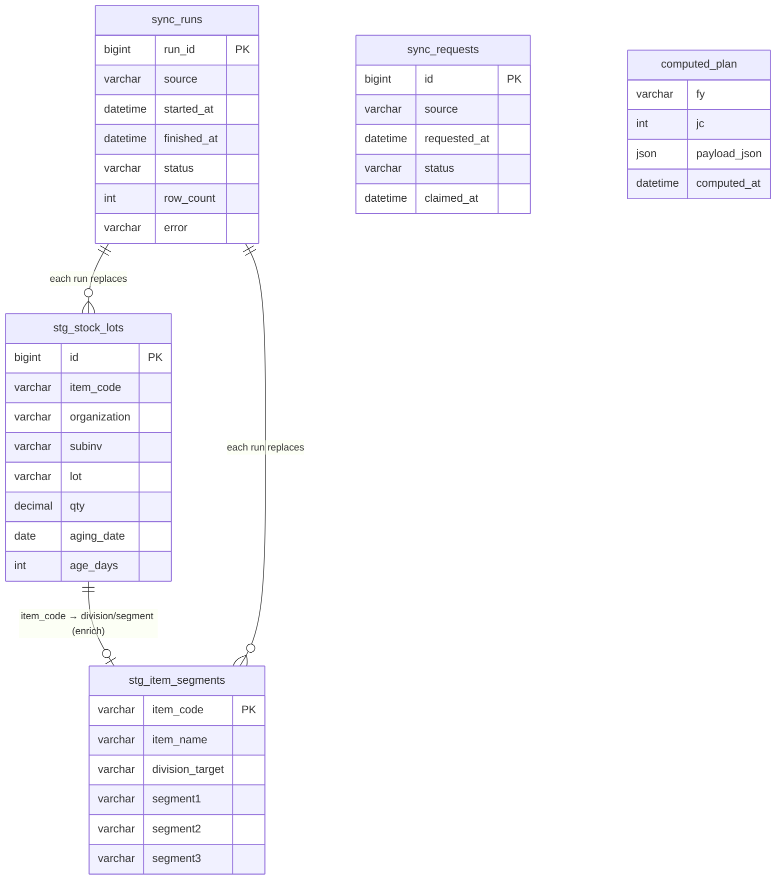
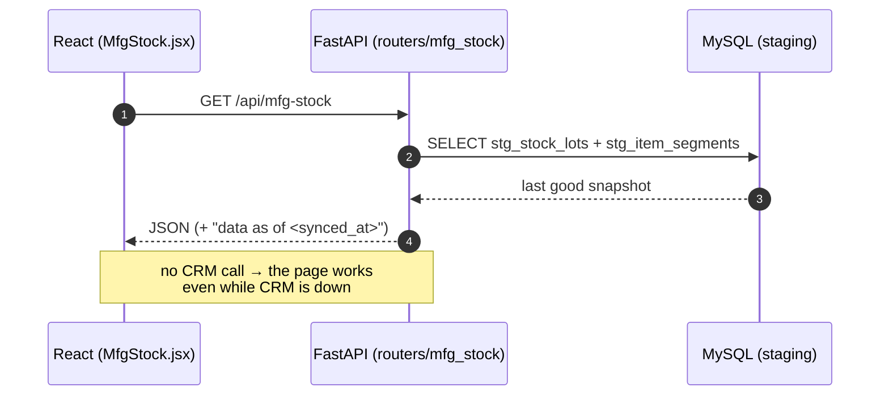
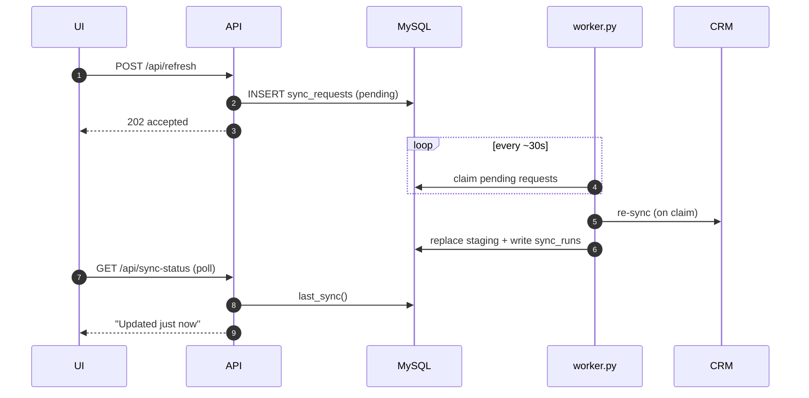

# S&OP Planning Tool — Target Architecture (Design Doc)

**Status:** proposal for review · **Scope:** single on-prem server · **Freshness target:** CRM data a few minutes old is acceptable (scheduled sync + "Refresh now").

This document describes where the backend is today, what's wrong with it for production,
and the target "sync-to-DB, serve-from-DB" architecture — plus a concrete, incremental
migration plan that keeps the app working at every step.

## Implementation status (updated as phases land)

**Done — 13 CRM sources now served from MySQL (worker syncs; API reads staging):**

| Source | Staging table | Pages made CRM-outage-proof |
|---|---|---|
| item_segments, stock_lots | stg_item_segments, stg_stock_lots | MFG-Stock |
| stock_details, item_business, pto_pts | stg_stock_details, stg_item_business, stg_pto_pts | orgs, item master |
| stock_aged, vooki_items, soc_schedule | stg_stock_aged, stg_vooki_items, stg_soc_schedule | Aged-RM |
| projection, soc_pending, soc_detail, intransit | stg_projection, stg_soc_pending, stg_soc_detail, stg_intransit (+ sync_context) | **RM-Plan, Adhoc** |
| dispatch (jc3 + jc13) | stg_dispatch (long↔wide pivot) | **MSL, RM-Plan (MSL top-ups)** |
| user_scope (6 CRM mapping tables → 8 personas) | stg_user_scope (one row per user × atomic grant; CSV collector lists exploded) | **My Dashboard** (see `db/migrate_user_scope.sql`) |
| dispatch_scope (FnDespatchDetails, 13-JC window) | stg_dispatch_scope (JC × item × customer × collector × mc_code, qty + value) | **My Dashboard** charts (see `db/migrate_dashboard.sql`; item_segments also gained segment4) |
| projection_rows (now JC1..current, not just the planning JC) | stg_projection_rows | **My Dashboard** projection-accuracy trend for collector-scoped personas |
| order_commit (**dbo.SocPendingDetails**, CRM's daily pending-SOC snapshot) | stg_order_commit (whole pending book: committed + rescheduled + customer-requested dates, reasons, warehouse note, executive, segments) | **Commitment Risk** page (see `db/migrate_commit.sql`) |
| projection_customer (SCBusinessMonthlyPlanDtls, JC1..planning JC) | stg_projection_customer (customer × item × collector × JC, week1/week2 split, mc_code from the customer's primary site, item_code from itemmasters) | **Demand Protection** page (see `db/migrate_demand_ledger.sql`) |

**Promise Dates — the supply timeline.** Per item, every dated supply event goes on
one ladder and the company's dated firm orders burn it down: stock on hand today,
production (saved-plan job end + `receipt_std_lead_days`), and open POs. From the walk:
`ctp` (first date the running balance covers what is needed), `risk_date` (first date it
goes negative), `days_to_risk`, and `slip_days = ctp - required`.

Four rules that are easy to get wrong:

* **A node is always evaluated at TODAY.** Seeding the promise from the opening balance
  ignored orders already past due — they are applied today and must consume stock before
  anything can be promised out of it. Getting this wrong wrongly promised 16 items
  "available now".
* **Inbound PO arrival is MODELLED, never promised.** `BiPoDetails` has no
  expected-arrival column, so arrival = po_date + the item's average lead time from our
  own receipt history (median 14 days). Every such event carries `estimate=True` and the
  UI marks the date `~`.
* **MSL is a warning here, not a wall.** Phase 2's ATP subtracts it ("how much is safe to
  plan against"); a promise date answers "when can we physically deliver", and 45% of
  exposed items already sit below their safety level. The promise is made and
  `breaches_msl` is flagged.
* **The requirement is dated to a half-cycle.** A projection carries no day-level date —
  only which half of the JC the planner used. Day-level slippage exists only where a
  CUSTOMER requested date does, and that lives on order lines.

Coverage ceiling: only 83 of 347 exposed items carry any forward supply (34 production,
49 inbound). The rest are reported as "no dated supply" rather than given an invented
date — nothing planned is visible to us, which is not the same as cannot be supplied.

**Supply Competition — the ATP rule.** Per item, company-wide:
`atp = on_hand - firm_total - msl` and `atp_for_me = on_hand - firm_others - msl`;
a persona's exposure is `max(0, my_unprotected - max(0, atp_for_me))`. Three things
this depends on, each measured rather than assumed:

* **On-hand counts the orgs that SELL** — the 96 that appear on open committed
  lines — not the planning `warehouse_orgs` list (22 MFG/trading orgs that feed the
  RM plan). Using `warehouse_orgs` hides the branch and port stock the orders draw
  from and drops item coverage from 89% to 45%.
* **The stale book never consumes supply.** Lines overdue by 90+ days (38.6M KG of
  71.1M) are uncleared paperwork; counting them shows almost everything as oversold.
  They are reported separately.
* **A negative ATP is normal.** Across the live order book on-hand covers only part
  of committed demand — this is a make-to-order manufacturer, so production fills
  the book. Incoming production (from the newest saved JC plan) is what separates
  "at risk, recoverable" from "high risk".

Item keys are the SQUASHED name everywhere. `commit_by_item` groups on the squashed
key in SQL rather than `UPPER(TRIM(...))`: 40 names differ only by punctuation, and
grouping the looser way let the caller's dict silently drop 2.6M KG of firm demand.

`stg_order_commit` carries collector NAMES only, so the order book is scoped with
`_commit_flt` while the projection ledger uses `_scope_flt` (collector ids). Passing
the projection filter to the order book would leave a collector-scoped persona
unrestricted — it would show them the whole company's book as their own.

Competing customers are named only inside the caller's own scope; everything else
rolls up by collector and market circle (`SHOW_ALL_HOLDERS` widens this). CRM cannot
name the competing executive at all — `EXECUTIVE_NAME` is "No Sales Credit" on 97%
of open lines, so it is nulled at ingest.

The production schedule behind `incoming` is cached on the PLAN id, not the sync
stamp: it costs ~18s to build against ~1.4s for the rest of the supply picture, and
only changes when someone saves a new plan.

**Demand Protection — the cover rule.** A projection counts as protected when
`min(projection, dispatched_in_cycle + open_SOC_due_in_cycle)`. Dispatch MUST be in
that sum: a projection that converted and already shipped has no open SOC line left,
so open orders alone report every successful sale as a failure (JC6 measured 9.6%
open-SOC-only vs 32.4% including dispatch). Firm demand is attributed to the JC its
current commitment date falls in; anything already overdue when the cycle opens is
reported separately as backlog and never counted as cover. CRM's own
`jc{n}_qty_achieved` is not used — it reports 251% achievement for JC6.

Verified with CRM deliberately unreachable: MFG-Stock, Aged-RM, MSL, Adhoc, and
**RM-Plan (59 products)** all build entirely from MySQL. The 7.6-minute `soc_pending`
query now runs once in the worker instead of blocking a page request.

**Remaining CRM calls (2, page-specific — not in the RM-Plan path):**
`business_plan_projection` (multi-JC, Projection-Accuracy) and
`business_plan_projection_rows` (Projection-vs-Sales).

**Done — Phase 4 (operational):** `worker.py --schedule` (APScheduler: full sync every
20 min + drains the Refresh-now queue every 30s), `GET /api/sync-status`,
`POST /api/refresh`, and a "Data as of…" + Refresh banner in the app header.

**Done — Phase 3 (instant pages):** the worker precomputes the RM-Plan after each sync
(`compute_rm_planning` → `computed_plan` table); the API `_rm_planning()` just reads the
stored JSON. Measured: a 40s build now serves in **~70 ms** on the page (and survives a
CRM outage). Override/upload plans still build on demand (user-initiated).

**Done — projection pages:** `projection` now stages JC1→current × approved/unapproved
(`stg_projection.approved`) for Projection-Accuracy, and `projection_rows`
(`stg_projection_rows`, per collector) for Projection-vs-Sales. Both render with CRM down.

**Every planning page is now CRM-outage-proof.** The only live CRM calls left are, by
design: interactive admin lookups (`crm_items`, `crm_users`, `crm_user_departments` — SRDMS
item search / User-Master approvals) and `despatch_pending_mfg_rows` (used only in the
export-by-segment ZIP download, which is user-initiated).

---

---

## 1. Where we are today

The web request path does **three heavy things inline**:

```
Browser ──▶ FastAPI route ──▶ ① query CRM (SQL Server, live)
                              ② run planning math (planning_filter.py, ~3000 lines)
                              ③ serialize + return JSON
```

The only thing that stops CRM being hit on every click is an **in-memory** `@lru_cache`
inside the running Python process.

### Consequences
| Symptom | Root cause |
|---|---|
| Cold start ~150s | The dataset + RM plan are built from CRM on the first request / prewarm. |
| CRM outage → pages empty | No durable copy of CRM data; the cache is RAM-only. |
| Every restart re-queries CRM | Cache is in-process memory, lost on restart. |
| Heavy math blocks requests | BOM explosion / netting runs in the web worker. |
| Can't run more than one instance | Cache is per-process; state is not shared. |
| No history of CRM state | Nothing is persisted, so no trend / no audit of "what did stock look like at JC4?". |

**Note:** this is a reasonable *prototype* pattern (read-through cache). It is not "wrong" —
it simply was not built for resilience, restart-safety, or scale.

---

## 2. Target architecture: sync-to-DB, serve-from-DB

Separate the three concerns into **two processes** that communicate only through MySQL.

```
        ┌───────────────────────────────────────────────┐
CRM ───▶ │  worker.py   (APScheduler — every ~20 min)     │
SQLSvr   │    SYNC:    CRM  → MySQL staging tables         │
BOMfiles │    COMPUTE: staging + BOM → plan → MySQL         │──┐ writes
─────────│    also runs on a "refresh now" request         │  │
         └───────────────────────────────────────────────┘  ▼
                                              ┌────────────────────────────┐
                            reads only        │           MySQL            │
                     ┌──────────────────────▶ │  stg_* (current CRM state) │
                     │                        │  computed_plan (RM plans)  │
       ┌─────────────┴────────────────┐       │  sync_runs (freshness log) │
React ─▶│  main.py  (FastAPI API)      │       │  JC_PLAN / confirmations…  │
UI     │  reads MySQL only → instant,  │       └────────────────────────────┘
        │  always up, returns synced_at │
        └──────────────────────────────┘
```

- **API (`main.py`)** never talks to CRM. It reads staging + computed plans from MySQL.
  Fast, restart-safe, available even while CRM is down or the worker is mid-run.
- **Worker (`worker.py`)** is the only component that touches CRM and runs the planning
  engine. Scheduled every ~20 min; also triggered on demand.
- **Coordination is through MySQL** — no message broker needed on a single server.

### What this fixes
Instant cold start · CRM-down resilience (serve last good snapshot) · restart-safe ·
heavy compute off the request path · stateless API (can scale later) · CRM history for free.

---

## 2a. Diagrams

### Entity-Relationship — the new tables (Phase 1)



*Note:* the `item_code` link and `sync_runs → stg_*` are **logical** relationships (join
key / provenance), not enforced foreign keys — staging tables are replaced wholesale.
`computed_plan` is the Phase-3 table (shown for context).

### Sequence — scheduled sync (worker → CRM → MySQL)

```mermaid
sequenceDiagram
    autonumber
    participant W as worker.py (scheduled)
    participant CRM as CRM SQL Server
    participant DB as MySQL (staging)
    W->>DB: INSERT sync_runs (status=running)
    W->>CRM: SELECT stock_lots / item_segments
    CRM-->>W: rows
    W->>DB: BEGIN; DELETE stg_*; INSERT rows; COMMIT
    Note right of DB: readers keep seeing the<br/>previous snapshot until COMMIT
    W->>DB: UPDATE sync_runs (status=ok, row_count)
```

### Sequence — a page request (UI → API → MySQL, CRM never touched)



### Sequence — "Refresh now"



---

## 3. Data model & refresh strategy

The central decision: **how do sync writes update the tables?** It depends on the data type.
The default for current-state data is **UPSERT (replace-in-place by key), never blind append.**

### Table strategies
| Table | What it holds | Write strategy |
|---|---|---|
| `stg_stock`, `stg_soc_pending`, `stg_projection`, `stg_item_master`, `stg_pto_pts` | **current state** (only "now" matters) | **UPSERT + prune by run_id** (or full-replace-via-shadow-swap) |
| `PO_RECEIPTS`, `stg_dispatch` | **immutable events** (accumulate) | **UPSERT by event key** (dedup) — already implemented for PO |
| `sync_runs` | one row per sync attempt | **APPEND** — this is the freshness log + audit |
| `computed_plan` | the finished RM plan per cycle | **UPSERT by (fy, jc)** — one current plan |
| `stg_stock_snapshot` *(optional)* | periodic stock snapshots for aging/trend | **APPEND with run_id** + retention policy |

### Why not blind append for staging
Appending current-state data every sync produces **duplicate rows** for the same item
(one per sync) and unbounded growth; every query would then need "latest per item".
Upsert keeps exactly one current row per entity.

### The deletion gotcha
Upsert updates/inserts but never removes rows that **disappeared** from CRM (e.g. stock
went to zero and CRM stopped returning it). Handle with one of:
- **Full-replace-via-shadow-swap**: load into `stg_stock_new`, then `RENAME TABLE` swap —
  deletions handled automatically, no empty window; **or**
- **Upsert + prune**: stamp every row with the current `run_id`; after the run,
  `DELETE FROM stg_stock WHERE last_run_id < :this_run`.

### Never truncate the live table
Do not `TRUNCATE` then `INSERT` on a table the API reads — a request in the gap sees it
empty. Use the shadow-swap or a transaction so readers always see a complete snapshot.

### `sync_runs` shape
```
sync_runs(
  run_id      BIGINT PK AUTO_INCREMENT,
  source      VARCHAR(32),     -- 'stock' | 'projection' | 'compute' | 'all'
  started_at  DATETIME,
  finished_at DATETIME NULL,
  status      VARCHAR(16),     -- 'running' | 'ok' | 'error'
  row_count   INT NULL,
  error       VARCHAR(255) NULL
)
```
The API reads the latest `ok` run per source to show **"data as of 09:32"** and to warn
when the last sync failed.

---

## 4. "Refresh now" (no message broker)

1. UI button → `POST /api/refresh` → API inserts a row into a small `sync_requests` table.
2. `worker.py` polls `sync_requests` every ~30s (in addition to its schedule), claims the
   request, runs sync + compute, writes `sync_runs`.
3. UI polls `GET /api/sync-status` → shows "Refreshing…" then "Updated 2 min ago".

Durable (survives restarts), single-server-friendly, and no Redis/Celery required.

---

## 5. What changes in the existing code

| Component | Change |
|---|---|
| `app/integration/crm_sources.py` (CRM SQL) | **Moves to the worker**, unchanged — same queries, run on a schedule instead of per request. |
| `app/api/live.py` loaders (`_crm_stock`, …) | Stop calling `_crm.*`; instead `SELECT` from the `stg_*` tables. Small mechanical change per loader. |
| `app/integration/planning_filter.py` (engine) | **Untouched** — the worker feeds it staging rows instead of live CRM rows. |
| `app/prewarm.py` + the lifespan prewarm | **Removed** — nothing heavy runs in the API startup anymore. |
| `app/integration/mysql_db.py` | Gains the staging upsert/prune helpers (generalizing the existing `ingest_po_receipts`). |
| New: `backend/worker.py` | APScheduler process: sync jobs + compute job + `sync_requests` poller. |

The React frontend is largely unchanged — add a **freshness indicator** ("data as of …")
and a **Refresh now** button.

---

## 6. Tech choices (right-sized for one server)

- **Scheduler:** `APScheduler` (in-process to `worker.py`). Simple, no broker. Move to
  Celery/RQ + Redis **only** if you later need multiple workers, retries, or isolation.
- **Database:** stay on **MySQL** (already in use). Add `stg_*`, `sync_runs`, `sync_requests`,
  `computed_plan`.
- **Cache:** **Redis not needed** at this scale — MySQL reads are fast, and there is one API
  process. Add it only when running multiple API instances.
- **Deployment:** two processes on the one on-prem box:
  `python main.py` (API) and `python worker.py` (sync+compute). Run each under a
  process manager (NSSM/Task Scheduler on Windows, or systemd on Linux).

---

## 7. Migration plan (incremental — app works after every phase)

**Phase 0 — Metadata (½–1 day)**
Add `sync_runs` + `sync_requests` tables and a `synced_at` concept. No behavior change yet.

**Phase 1 — Prove the pattern on ONE source: stock (2–3 days)**
1. Create `stg_stock` (+ upsert/prune helper).
2. `worker.py` with one job `sync_stock()`: CRM `stock_lots` → upsert `stg_stock` → write `sync_runs`.
3. Point `_crm_stock()` / `_mfg_stock()` at `stg_stock` instead of CRM.
4. **Acceptance test:** MFG-Stock page renders from DB; then stop CRM and confirm it *still* works. 🎯

**Phase 2 — Migrate remaining sources (~1 week)**
projection, SOC pending, dispatch, item master, PTO/PTS → their own `stg_*` tables + sync jobs.

**Phase 3 — Offload compute (3–5 days)**
Move `_build_rm` / planning into a worker job that writes `computed_plan`; the API serves the
last computed plan. Remove the prewarm.

**Phase 4 — Schedule + Refresh now (1–2 days)**
APScheduler runs the full sync+compute every ~20 min; wire `POST /api/refresh` + the UI indicator.

**Phase 5 — (optional, later) Scale**
Only if needed: Redis cache + multiple API instances + Celery/RQ. No rewrite required — the
API is already read-only against MySQL.

---

## 8. Trade-offs & decisions

- **Staleness:** data is as fresh as the last sync (~20 min) — acceptable per requirement.
  The "Refresh now" button covers the "I need it now" case.
- **CRM load:** far lower — a handful of scheduled queries instead of per-request bursts.
- **Failure mode:** if a sync fails, the API keeps serving the previous snapshot and shows a
  "last sync failed at HH:MM" warning (from `sync_runs`).
- **Consistency:** each `stg_*` table is internally consistent (shadow-swap / transaction);
  cross-source consistency is "as of the last full sync run".
- **History:** optional snapshot tables unlock trend/what-changed analysis and make the
  Projection-Accuracy page a natural byproduct.

---

## 9. Summary

Move CRM access and the planning engine **out of the request path** into a scheduled
`worker.py`; persist a **current snapshot** of CRM in MySQL `stg_*` tables (upsert-in-place,
pruned for deletions) plus the **computed plan**; and make the FastAPI API a thin, fast,
always-available **reader** of MySQL. It reuses the pattern the codebase already has for
`PO_RECEIPTS`, needs no new infrastructure, and grows into horizontal scale without a rewrite.
