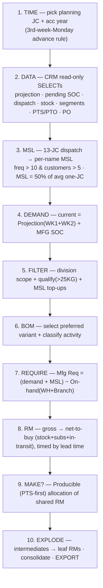
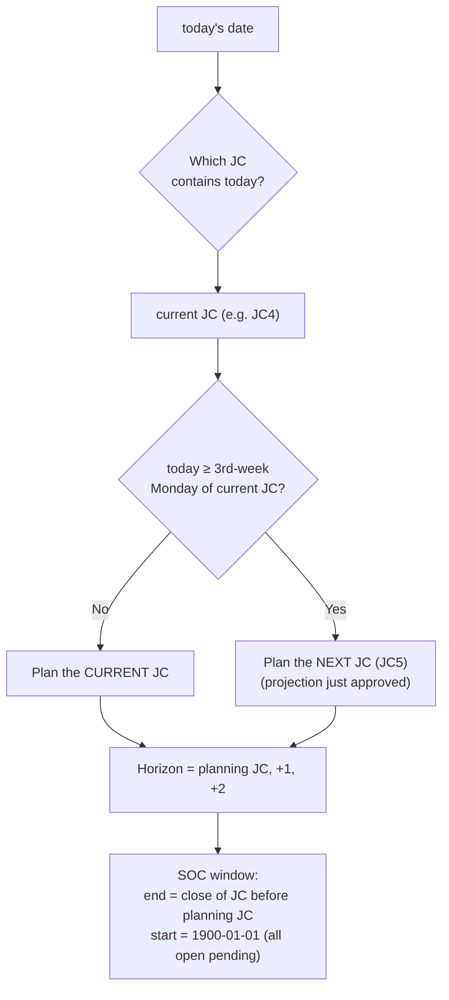
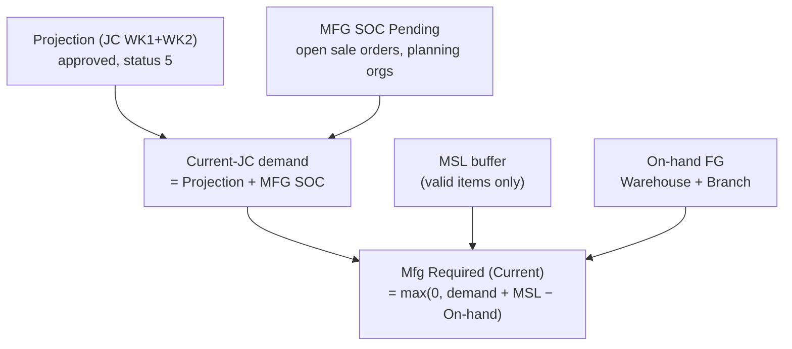
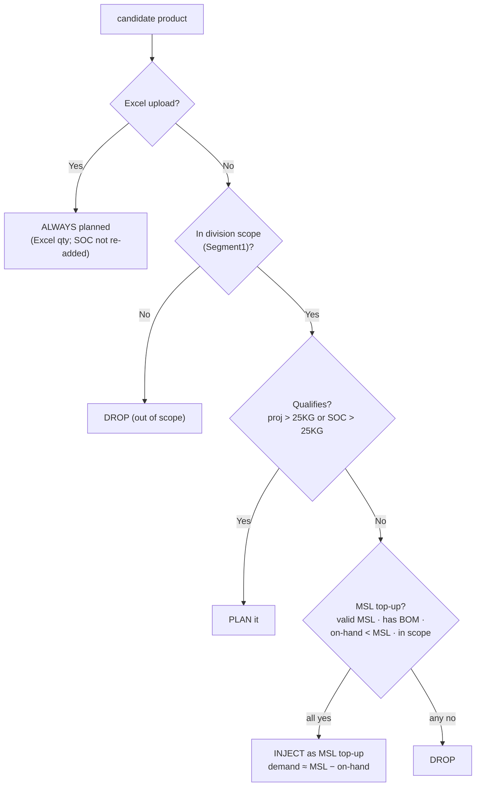
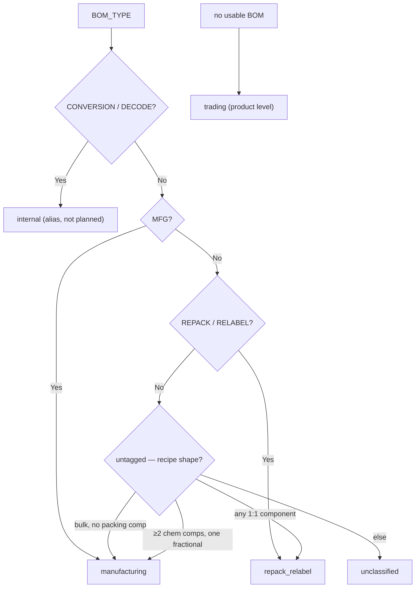
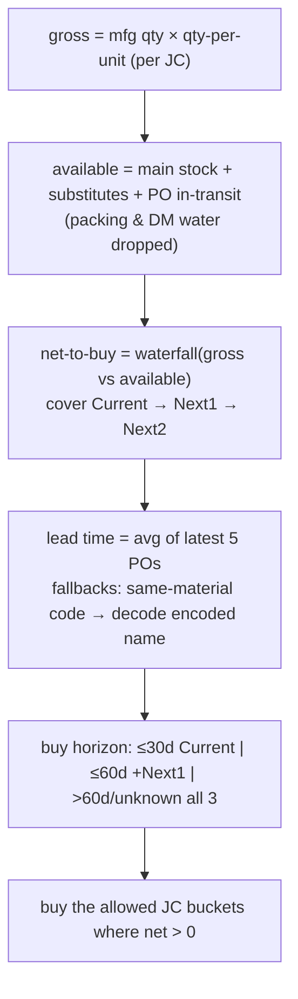
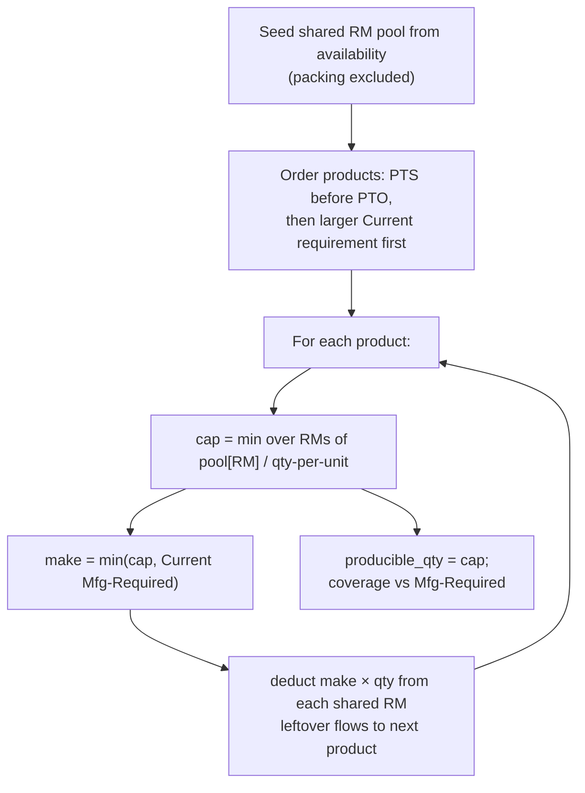
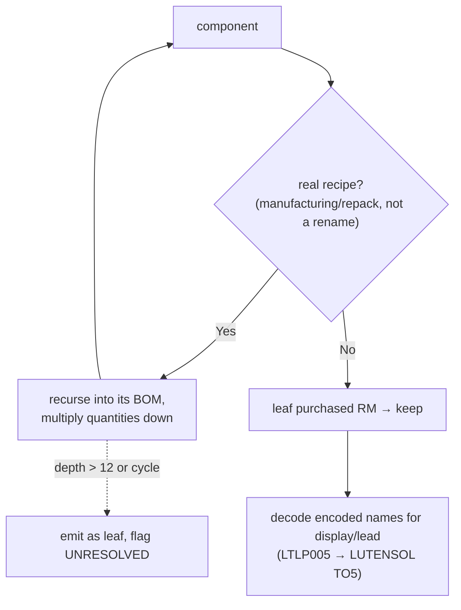
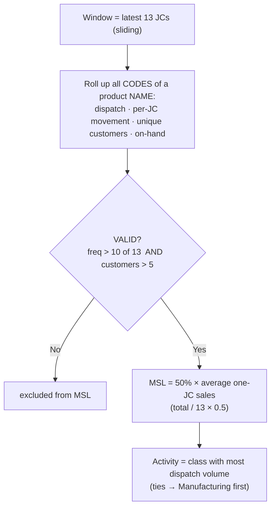

# Supply Planning — Flowcharts (Mermaid)

Companion to **Planning_Logic_and_Assumptions.docx**. These render graphically in VS Code
(Markdown preview), GitHub, or any Mermaid viewer, and can be exported to PNG/SVG.

---

## 1. End-to-end planning pipeline

---

## 2. JC time model — choosing the JC and the SOC window

---

## 3. Demand build — manufacturing requirement

---

## 4. Item selection & MSL top-up decision

---

## 5. Activity classification

---

## 6. Component requirement & net-to-buy

---

## 7. Producible — PTS-first shared-RM allocation

---

## 8. Real-RM explosion

---

## 9. MSL computation

